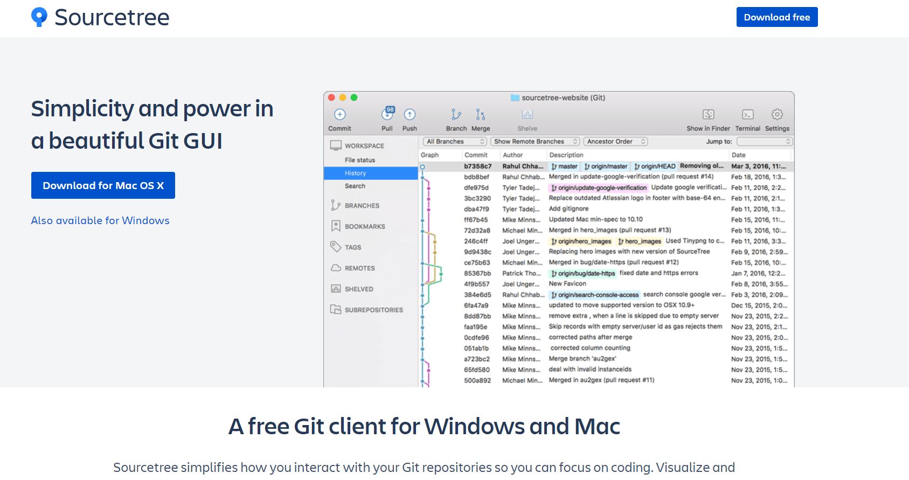

- [Github](#github)
  - [Pasos para aportar a otro repositorio](#pasos-para-aportar-a-otro-repositorio)
- [Sourcetree](#sourcetree)
- [Bitbucket](#bitbucket)

[Regresar](./README.md)

# Github

* Creamos un nuevo repositorio en https://github.com/new
* `git remote add origin https://github.com/jdpoccorie/repo.git` Agregamos un repositorio remoto a nuestro repositorio local 
* `git branch -M main` Renombramos nuestra rama *master* a *main*
* `git push -u origin main` Realizamos la primera publicación de nuestro repositorio local al remoto
* `git push` despues de la primera publicación podemos escribir solo este comando sin el origin para publicar nuestras confirmaciones locales
* `git push origin <nombre_rama>` Publicar *nombre_rama* al repositorio origin
* `git fetch origin <nombre_rama>` Para actualizar mi repositorio local, si en caso nuestro repositorio remoto tenga cambios
* `git merge origin/main` Para fusionar el main local con los cambios que llegaron con el **fetch**

## Pasos para aportar a otro repositorio

1. Hacer un fork en GitHub
2. Clonar el ropositorio desde la cuenta de github que hizo fork
3. Crear una rama local.
4. Realizar nuestros aportes en esa nueva rama local
5. Confirmar los cambios realizados en local
6. Hacer push de mis cambios `git push origin <nombre_rama>`, a veces aparece errores por el usuario global para solucionar este problema hacer lo siguiente:

Escribir el comando
```
git config --global --edit
```
Agregar las siguientes líneas al final del archivo
```
[credential]
  helper = osxkeychain
  useHttpPath = true
```
7. Crear un pull request con la nueva rama de mi repositorio en GitHub
8. Esperar a que el administrados acepte mis cambios(pull request)

# Sourcetree

(https://www.sourcetreeapp.com/)



* Para descargar el .exe (https://product-downloads.atlassian.com/software/sourcetree/windows/ga/SourceTreeSetup-3.3.9.exe)

# Bitbucket

Podemos agregar diferentes repositorios remotos, ya sea github, bitbucket gitlab etc.

Un ejemplo para agregar un repositorio remoto de bitbucket sería:
```
git remote add <name_bitbucket> https://JDiegoPoccoriE@bitbucket.org/jdpoccorie/jdpoccorie-git.git
```
```
$ git remote -v
bitbucket       https://JDiegoPoccoriE@bitbucket.org/jdpoccorie/jdpoccorie-git.git (fetch)
bitbucket       https://JDiegoPoccoriE@bitbucket.org/jdpoccorie/jdpoccorie-git.git (push)
github  https://github.com/jdpoccorie/jdpoccorie-git.git (fetch)
github  https://github.com/jdpoccorie/jdpoccorie-git.git (push)
```

> Podemos configurar un mismo proyecto para sincronizar varios repositorios remotos