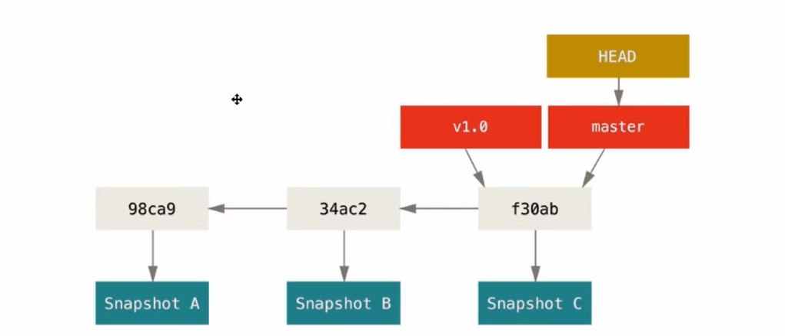

- [RAMAS](#ramas)
  - [Crear Rama](#crear-rama)
  - [Moverse entre las ramas](#moverse-entre-las-ramas)
  - [Fusión de ramas](#fusión-de-ramas)
    - [Listar Ramas fusionadas](#listar-ramas-fusionadas)
  - [Eliminar Ramas](#eliminar-ramas)
- [Conflictos con Ramas](#conflictos-con-ramas)

[Regresar](./README.md)

# RAMAS

(https://uniwebsidad.com/libros/pro-git/capitulo-3/que-es-una-rama)

Una rama en git es un apuntador móvil, se ira moviendo con las nuevas características que agreguemos. La rama master es un apuntador también ademas de ser la rama principal, las etiquetas tambien son unos apuntadores solo que estas permanecen estáticas 



> En estos aspectos las ramas ayudan a trabajar modularmente.

> **HEAD**: Nos dirá donde estamos parados, en que rama estamos actualmente

## Crear Rama

```
git branch testing
```
Creará una rama en el commit en donde estemos con el nombre **testing**

## Moverse entre las ramas
```
git checkout testing
```
Nos permite movernos a la rama **testing**

> No importa en que rama estemos, podemos crear una rama estando en cualquier rama, osea no es necesario estar en la rama master

## Fusión de ramas

Para fusionar ramas usamos el comando `git merge`
```
git merge otra_rama
```
Lo que hace el comando es fusionar *otra_rama* a la rama en donde estamos

> Puedo crear todas las ramas que quiera o necesite no necesariamente estando en la rama master

> Las ramas nuevas que se crean apuntan al commit actual, donde esta ubicado el apuntador **HEAD**

* `git merge <nombre_rama>` Nos permite fusionar *nombre_rama* a la rama actual en donde estamos

> Podemos fusionar cualquiera de las ramas, no es necesario que sea la rama master, sin embargo lo recomendable es fusionar la rama más cercana

### Listar Ramas fusionadas

* `git branch --no-merged` Lista las ramas que no han sido fusionadas con la rama actual
* `git branch --merged` Lista las ramas que ya han sido fusionadas con la rama actual. (Nos sirve para tomar decisiones al momento de eliminar una rama)

## Eliminar Ramas

* `git branch -d <nombre_rama>` Elimina *nombre_rama* si ya ha sido fusionada con la rama actual

> ***-d*** Tener en cuenta de que esta opción solo funcionara si la rama a eliminar ya ha sido fusionada con la rama actual

> ***-D*** Si queremos eliminar la rama aunque no hayamos fusionado osea no nos importe los commits de esa rama podemos formazarlo con esta opción.

# Conflictos con Ramas

Los conflictos aparacen cuando se modifican la misma linea de un mismo archivo, el conflicto es que git no sabe a que linea hacer caso. Entonces git nos pregunta a que linea hacer caso.

* La solucion de ramas se hace de forma **manual**

```
<<<<<< HEAD (Cambio actual)

CAMBIOES EN EL HEAD

======

CAMBIOS EN <nombre_rama>

>>>>>> nombre rama (Cambio entrante)
```

El archivo sera modificado por el both del repositorio de git y nosotros tendremos que solucionar el conflicto manualmente escogiendo que lineas salvar y que otras eliminar. VSCode nos ayuda bastante con esto, podemos modificar cualquier otra parte del documento.

Una vez solucionado el conflicto podremos hacer el **commit** como siempre.
